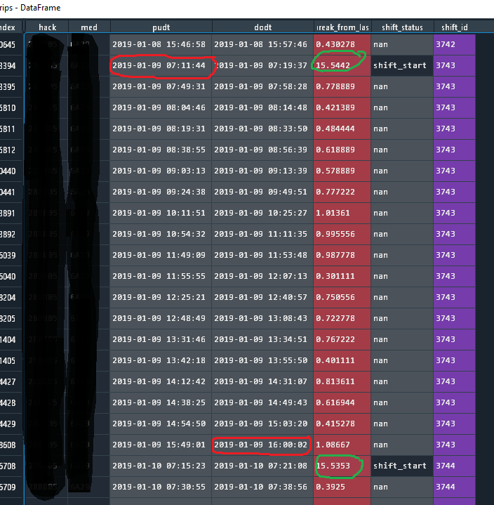

# A data pipeline to calculate and track taxi shifts

# Purpose

Those who know the taxi industry know that Yellow and Green New York City Taxis operate within a shift model,
that is drivers work 7-12 hour shifts, passing vehicles they lease to their partners after their shift ends.
Our organization does not collect data that accurately tracks this work arrangement. We do not know when a shift starts or ends. 
I was tasked with the objective of using our existing trip data to impute shift start and end times. I was also required to build pertinent metrics around these new
definitions and track them over the best time interval I could identify. I chose to look at shifts over the course of a month as this would account for overlap during week breaks and 
was manageable given my computer specs. 

# The Prep

I started this challenge by identifying what my result needed to be; a table of metrics tracked over month and year and couched in a driver's shift. I produced the specs below:

```
CREATE TABLE  med_monthly_shift_metrics
(
hack    varchar(20),
med     varchar(20), 
shift_id     int,
shift_start_time  datetime,
shift_end_time    datetime,
trips_per_shift   int,
total_hours_per_shift   float,
trip_hours_per_shift float,
cruise_hours_per_shift float,
distance_per_shift float,
fare_per_shift float,
tip_per_shift float,
surcharge_per_shift float,
total_amount_per_shift float,
shift_type VARCHAR(10),
metric_weekday VARCHAR(10),
metric_month date
PRIMARY KEY (metric_month,shift_id)
);
```

This table would be housed in our SQL Server Datawarehouse; an analytical layer we built to host pertinent metrics that feed our policies and dashboards. I decided, based on my research, to look at the time between trips and see if there was a threshold at which drivers seemed to stop driving for a long time; this break is what we call the end and start of a shift. The magic number turned out to be 4 hours. 

# The How

A task like this for us would be completed with SQL, R, Python or a combination of the sort. In our case I chose to primarily use a pythonic solution. Our SQL Server receives a lot of traffic and a SQL solution seemed more complex and computationally difficult. In addition, my team and I already had an alternative data source solution;
we created a data pipeline that recorded each day of trip records as a parquet file saved in a directory so we could perform rapid calculations that could be parellalized through iteration. Below you can see what that looks like (tpep is a short hand we use to refer to yellow taxis):  

Yellow Taxi Trips             |  Green Taxi Trips
:-------------------------:|:-------------------------:
  |   

With our initial data source pegged and our result identified below was the general workflow I produced to capture what we needed:

1. Read a month of trip data
    1. bind the month together
    2. clean it up
2. Calculate the shift
    1. order the trips
    2. calculate breaks
    3. demarcate the beginning of breaks greater than or equal to 4 hours
    4. build a unique id associated with every shift for a driver and their vehicle
3. Build metrics
    1. build metrics grouped by month, year and the unique shift
4. Load data to SQL
    1. create a table in SQL and procedures for updating data
    2. load the remaining data frame to our SQL Server
5. Automate the process
    1. set up to run once a month

# Reading a month of trip data

The projects scripts are (here)[https://github.com/datafaust/data-engineering-sample/tree/main/Python/shift_builder]; but I will go over the basics of how I achieved each piece. As I work with temporal data a lot, I like functions that can take a date and run what I need, I started by writing a function that pulls a month of data:

```
#matches parquet files in a directory for defined range with yyyy-mm-dd 
def pull_range(dir,start, stop):
     start_date_time = dt.datetime.strptime(start, '%Y-%m-%d')
     stop_date_time = dt.datetime.strptime(stop, '%Y-%m-%d')
     
     return [file
            for file in Path(dir).glob('*')
            if (start_date_time <= 
                dt.datetime.strptime(file.stem.split('_')[-1], '%Y-%m-%d')
                <= stop_date_time)
            ]

#concatenate an entire month of trips and bind them
def pull_month(mnth, taxi_type, dirs):
    
    #define columns
    cols = ["hack",taxi_type,"pudt","dodt","fare","surcharge"
           ,"mtaTax","tip","tolls","improveSurch","distance"
           ,"ehailFee","trip_time_hours","total_amount"]
    
    #produce start and end
    start = mnth
    stop = str(dt.datetime.strptime(mnth, '%Y-%m-%d') + relativedelta(months=+1) + dt.timedelta(days=-1))[0:10]
    #print(start)
    #print(stop)
    
    #extract parquet files that match range
    my_days = pd.date_range(start=start,end=stop)
    filez = pull_range(dirs[taxi_type], start, stop)
    
    #loop through the files, read and bind them - some clean up in this step
    trips=[]
    for file in filez:
        df = pd.read_parquet(file, engine='pyarrow')#[1:100000]
        
        #alter trip time into hours for shift calculations
        df['trip_time_hours'] = df['trip_time_secs']/3600
        
        #drop trip time since I don't need it anymore
        df.drop('trip_time_secs', inplace=True, axis=1)

        
        trips.append(df)
        del(df)
        gc.collect()
    
    #bind to one data frame
    trips= pd.concat(trips, axis=0, ignore_index=True)
    
    #keep trips that are shorter than or equal to 6 hours as these are considered valid
    trips = trips.loc[trips.trip_time_hours <= 6]
    
    #clean any leakage in trips that might have been coded wrong by DBA
    trips = trips.loc[trips.pudt >= start]
    trips = trips.loc[trips.pudt <= dt.datetime.strptime(mnth, '%Y-%m-%d') + relativedelta(months=+1)]

    #keep only the columns I need
    trips = trips[cols]
    del(cols, filez, my_days)
    gc.collect()
    
    return trips
```

# Calculating Shifts

Once I have a month's worth of trip data collected and cleaned I can then run a shift calculation on that trip data. The idea is to order the information by driver and vehicle, calculate the breaks between trips and demarcate when a break is greater than or equal to 4 hours. I then create a shift id unique to the first record after every 4 hour break. See the code below:

```
#calculate a shift - this entails looking for breaks of 4 hours or more between trips for the same driver and vehicle
def calculate_shift(df, taxi_type, rest):
    
    start_time = time.time()
    print('starting shift calculation...')
    
    group_by = ['hack'
                ,taxi_type
                ,'pudt']
    
    #set order of data set by driver and vehicle
    df = df.sort_values(by=group_by)
    
    #calculate cruise time between trips
    df['break_from_last'] = df['dodt'] - df.groupby(['hack'
                                                     , taxi_type
                                                     ])['pudt'].shift()
    
    #change calculation to hours
    df['break_from_last'] = df['break_from_last']/np.timedelta64(1, 'h')
    
    #calculate shift break
    df.loc[df['break_from_last'] >= rest, 'shift_status'] = 'shift_start'
    
    #any break from last that are empty are single trip shifts
    df.loc[(pd.isnull(df.break_from_last)), 'shift_status'] = 'shift_start'

    #generate a shift id and expand
    #anytime there is a shift start, generate a new id and then fill the value forward
    df['shift_id']=np.where(df['shift_status'].isna(),np.nan,df['shift_status'].eq('shift_start').cumsum())
    
    #fill shift_id forward
    df['shift_id'] = df['shift_id'].fillna(method="ffill")
    
    te = str(time.time() - start_time)
    print('shift calculation completed in ' + te + ' seconds.')
    
    return(df)
```

The code produces shifts as shown here; the driver and vehicle in this example are the same. You can see where the breaks occur and the shift_ids are tied to the breaks:



# Building metrics

Once shifts are calculated I can produce aggregations based on the unique shifts for each driver. In my case I preserved the orignal dataframe length as long as possible, in part because I felt it would help me identify any incorrect calculations more rapidly, but in a less hardware-friendly enviornment I would approach this somewhat differently. Below I run a series of functions to produce metrics and return a dataframe with unique shifts ready to load to SQL:

```
#perform hour calculations for shifts etc.
def time_calculations(df, group_by):

    
     #total hours per shift   
     temp = (
         df.groupby(group_by)['dodt'].last() - df.groupby(group_by)['pudt'].first()
         )/np.timedelta64(1, 'h')
     
     temp = temp.to_frame(name='total_hours_per_shift')
     df = pd.merge(df,temp, on=group_by, how='left')
     df['total_hours_per_shift'] = df['total_hours_per_shift'].round(2)
     del(temp)
     
     #calculate cruise hours per shift
     df['cruise_hours_per_shift'] = (df['total_hours_per_shift'] - df['trip_hours_per_shift']).round(2)
     
     #retrieve last dropoff as the end of shift 
     df['shift_end_time'] = df.groupby(group_by)['dodt'].transform('last')
     
     #rename pudt as shift start time - we will remove dups and keep the first row to preserve first and last trip for each shift
     df.rename(columns={'pudt': 'shift_start_time'}, inplace=True)
     
     return df

#build out pertinent metrics
def metrics_builder(df, taxi_type):
    
    start_time = time.time()
    print('starting metrics build...')
    
    #grouping list
    group_by = ['hack'
                ,taxi_type
                ,'shift_id']
    
    #counts
    df['trips_per_shift'] = df.groupby(group_by)['pudt'].transform("count")    
     
    #summations
    df['trip_hours_per_shift'] = (df.groupby(group_by)['trip_time_hours'].transform("sum")).round(2)
    df['distance_per_shift'] = df.groupby(group_by)['distance'].transform('sum')
    df['fare_per_shift'] = df.groupby(group_by)['fare'].transform('sum')
    df['tip_per_shift'] = df.groupby(group_by)['tip'].transform('sum')
    df['surcharge_per_shift'] = df.groupby(group_by)['improveSurch'].transform('sum')
    df['total_amount_per_shift'] = df.groupby(group_by)['total_amount'].transform('sum')

    #hours per shift and cruise time per shift
    df = time_calculations(df,group_by)
    
    #final cleanup and calculations
    df = df.drop_duplicates(subset=['shift_id'])    
    
    #code shift type as AM or PM
    df['shift_type'] = np.where(df['shift_start_time'].dt.hour < 12 , 'AM', 'PM') 
    
    #code the weekday for later 
    df['metric_weekday'] = df['shift_start_time'].dt.day_name()
    
    #code the month and year
    df['metric_month'] = df['shift_start_time'].dt.date.astype(str).str.slice(start=0, stop=7) + '-01'
    
    #reorder columns for final result
    cols = ["hack",taxi_type,"shift_id","shift_start_time"
            ,"shift_end_time","trips_per_shift","total_hours_per_shift"
            ,"trip_hours_per_shift","cruise_hours_per_shift","distance_per_shift"
            ,"fare_per_shift", "tip_per_shift","surcharge_per_shift"
            ,"total_amount_per_shift","shift_type","metric_weekday", "metric_month"]
    print(df['metric_month'].unique())
    df = df[cols]
    
    te = str(time.time() - start_time)
    print('metrics build completed in ' + te + ' seconds.')
    
    
    return df
```

# Loading data to SQL

With the data prepared, I needed to load it into our SQL Server. I decided to use SQLAlchemy and rely on a temp table - update model where I produce a temp table to stage data everytime this program runs and then update a production table via a SQL statement. The staging table would then be eliminated. I first created the tables I needed:

```
----FINAL MEDALLION TABLE
DROP TABLE IF EXISTS med_monthly_shift_metrics;
CREATE TABLE  med_monthly_shift_metrics
(
hack    varchar(20),
med     varchar(20), 
shift_id     int,
shift_start_time  datetime,
shift_end_time    datetime,
trips_per_shift   int,
total_hours_per_shift   float,
trip_hours_per_shift float,
cruise_hours_per_shift float,
distance_per_shift float,
fare_per_shift float,
tip_per_shift float,
surcharge_per_shift float,
total_amount_per_shift float,
shift_type VARCHAR(10),
metric_weekday VARCHAR(10),
metric_month date
PRIMARY KEY (metric_month,shift_id)
);

----FINAL SHL TABLE
----FINAL TABLE
DROP TABLE IF EXISTS shl_monthly_shift_metrics;
CREATE TABLE  shl_monthly_shift_metrics
(
hack    varchar(20),
shl     varchar(20), 
shift_id     int,
shift_start_time  datetime,
shift_end_time    datetime,
trips_per_shift   int,
total_hours_per_shift   float,
trip_hours_per_shift float,
cruise_hours_per_shift float,
distance_per_shift float,
fare_per_shift float,
tip_per_shift float,
surcharge_per_shift float,
total_amount_per_shift float,
shift_type VARCHAR(10),
metric_weekday VARCHAR(10),
metric_month date
PRIMARY KEY (metric_month,shift_id)
);
```

Then the loading procedure in Python:

```
#load to sql 
def load_to_sql(df, taxi_type, con):
    #load existing table to a temp structure in SQL
    #no need to create the table, let pandas handle that
    start_time = time.time()
    print('Loading to Database...')
    df.to_sql(name = taxi_type + '_monthly_shift_metrics_temp',con = con, index = False)
    te = str(time.time() - start_time)
    print('Successfully Loaded in ' + te + ' seconds.' )
    
    #insert records into main table
    #write sql syntax to insert records into main table
    insert_sql = '''insert into ''' + taxi_type + '''_monthly_shift_metrics (
            hack,''' + taxi_type + ''' 
            ,shift_id,
            shift_start_time,
            shift_end_time,
            trips_per_shift,
            total_hours_per_shift,
            trip_hours_per_shift,
            cruise_hours_per_shift,
            distance_per_shift,
            fare_per_shift,
            tip_per_shift,
            surcharge_per_shift,
            total_amount_per_shift,
            shift_type,
            metric_weekday,
            metric_month
            )
            select * from ''' + taxi_type + '''_monthly_shift_metrics_temp;'''
            
    drop_sql = '''DROP TABLE IF EXISTS ''' + taxi_type + '''_monthly_shift_metrics_temp;'''

    #basic row count before main table is updated
    prev_count = '''select count(*) as records_before_update from ''' + taxi_type + '''_monthly_shift_metrics;'''
    #row count after main table is updated
    post_count = '''select count(*) as records_after_update from ''' + taxi_type + '''_monthly_shift_metrics;'''
    
    
    con.execute(insert_sql)
    con.execute(drop_sql)
    prev = con.execute(prev_count).fetchall()
    post = con.execute(post_count).fetchall()
    print(prev)
    print(post)
```

I'll show the final run from the `main.py` file but the final product in our servers looks something like this:


Just in case I also cache the metrics as parquet files for backup:

```
#cache files to a directory of your choosing as a backup
def cache_metrics(mnth, df, taxi_type, dirs):
    direc = taxi_type + '_cache'
    os.chdir(dirs[direc])
    df.to_parquet('shift_metrics_'+ mnth[0:7] + '-01'  +'.parquet')
    print('wrote out ' + mnth[0:7] + '-01' + ' metrics to dir: ' + direc)
```

# Project structure

Often I see other data engineers and analysts setup a process that relies on one file that holds a lot of code with little documentation. I like to break down my projects and modularize them as that makes them easier to work with and much more transferable. I can also then wrap them in a `docker container` if need be. For that reason I organized my project as such; the structure map for reference is below:

```
-shift_builder
--etl
--->functions.py
--->__init__.py
--sql
--->create_tables.sql
--main.py
--historical_pull.py
--requirements.txt
```

`main.py` runs a combination fo the functions located in `functions.py` that are made globally available via the `__init__.py`. The only hard coded elements are the data source directories.

# Automating the process

We have an on prem server that we use to launch all our programs. We create a batch file for the program and set the project in Task Scheduler; for this project, it was set to run once on the 15th of every month. Alternatively in a unix enviornment I would use `docker` or a `cron` job.

The final `main.py` that ran via the batch file looks like this:

```
# -*- coding: utf-8 -*-
"""
Created on Tue Jul  6 12:54:20 2021

@author: lopezf
"""

#import all functions
import time
from etl import * 
from datetime import date, datetime
from dateutil.relativedelta import relativedelta
from sqlalchemy import create_engine
import urllib
import gc

#database params
server= 'TLCBDBDEV1'
driver= '{ODBC Driver 17 for SQL Server}'
database='policy_programs'
username= 'lopezf@tlc.nyc.gov'

#initiate connection
params = urllib.parse.quote_plus("Driver=" + driver +";Server=" + server +";DATABASE=" + database + ";Trusted_Connection=yes")
engine = create_engine("mssql+pyodbc:///?odbc_connect=%s" % params, fast_executemany=True)

#generate sequence of dates and extract directory files
#define data paths
paths ={
        'med':'I:/COF/COF/_M3trics2/records/med_parquet',
        'shl':'I:/COF/COF/_M3trics2/records/shl_parquet',
        'med_cache': 'I:/COF/COF/_M3trics2/records/med_shift_metrics_cache',
        'shl_cache': 'I:/COF/COF/_M3trics2/records/shl_shift_metrics_cache'
    }

#main function
def run_shifts(mnth, taxi_type, rest, con, dirs):
    start_time = time.time()
    print('running shifts for the month of: ' + mnth)
    #collect all the trips for the month 
    trips = pull_month(mnth, taxi_type, dirs)
    #calculate shifts
    trips = calculate_shift(trips, taxi_type, rest)
    #build out metrics
    trips = metrics_builder(trips, taxi_type)
    #cache metrics
    cache_metrics(mnth, trips, taxi_type, dirs)
    #load to db
    load_to_sql(trips, taxi_type ,con)
    #clean up
    del(trips)
    gc.collect()
    te = str(time.time() - start_time)
    print('month shifts processed in ' + te + ' seconds.')
    #return trips

#run function
if __name__ == "__main__":
    #params
    #mnth = '2019-01-01'
    taxi_type = 'med'
    rest = 4
    mnth = str(date.today())
    mnth = str((datetime.strptime(mnth, '%Y-%m-%d') + relativedelta(months=-1)).date())
    
    #public_cols = ["hack",taxi_type,"pudt","dodt","break_from_last","shift_status","shift_id"]
    
    trips = run_shifts(mnth, taxi_type, rest, engine, paths)[0:50000][public_cols]
```

The output of running one month of data looks like this:


# Parallelization

For jobs like this I like to have a parallelized option that I can use to recover data historically if need be. This is useful in case something happens to the data we loaded and the backup files. The file below caches metrics for loading later:

```
# -*- coding: utf-8 -*-
"""
Created on Tue Jul  6 12:54:20 2021

@author: lopezf
"""
#this file is meant to offer a parallelized version for multiple month pulls--------------------

#import all functions
import time
from multiprocessing import Pool
from etl import * 
from sqlalchemy import create_engine
import urllib
import gc
from functools import partial

#paths
paths ={
        'med':'I:/COF/COF/_M3trics2/records/med_parquet',
        'shl':'I:/COF/COF/_M3trics2/records/shl_parquet',
        'med_cache': 'I:/COF/COF/_M3trics2/records/med_shift_metrics_cache',
        'shl_cache': 'I:/COF/COF/_M3trics2/records/shl_shift_metrics_cache'
    }

#main function
def run_shifts(mnth, taxi_type, rest, dirs):
    print('running shifts for the month of: ' + mnth)
    #collect all the trips for the month 
    trips = pull_month(mnth, taxi_type, dirs)
    trips = calculate_shift(trips, taxi_type, rest)
    trips = metrics_builder(trips, taxi_type)
    cache_metrics(mnth, trips, taxi_type, dirs)
    #load_to_sql(trips, taxi_type ,con)
    del(trips)
    gc.collect()
    

#run manually
mnths = ['2019-01-01','2019-02-01', '2019-03-01'] 
def multi_shift_load(mnths, taxi_type, rest, dirs):
    start_time = time.time()
    print('starting pool')
    pool = Pool(6)
    print('trying partial')
    run_shifts_parallelized = partial(run_shifts, taxi_type=taxi_type, rest = rest, dirs = dirs)
    #calc2 = partial(calc, b=3, c=7)
    print('mapping...')
    #print(pool.map(calc2, [1, 2, 3, 4, 5, 6]))
    pool.map(run_shifts_parallelized, mnths)
    pool.close()
    pool.join()
    te = str(time.time() - start_time)
    print('parallelized shifts processed in ' + te + ' seconds.')

#run function
if __name__ == "__main__":
    multi_shift_load(mnths, taxi_type = 'med', rest = 4, dirs = paths)
```

The run looks like this:


# Thoughts

This covers the basic flow of shift calculations. Unforunately this doesn't capture the beginning and end of a shift in the sense that we don't see the time before or after the first and last trip. But we can get that information by conducting a survey and getting information from drivers on the average time
it takes to get a first trip or get home and then add that to the start and end times.